# Diagrammes UML - Format Mermaid

Ce document contient tous les diagrammes UML au format Mermaid, rendables sur GitHub, GitLab, VS Code, et la plupart des visualiseurs Markdown modernes.

---

## Table des Matieres

1. [Diagrammes de Classes](#1-diagrammes-de-classes)
2. [Diagramme Entite-Relation (ERD)](#2-diagramme-entite-relation-erd)
3. [Diagrammes d'Etats (State Machine)](#3-diagrammes-detats-state-machine)
4. [Diagrammes de Sequence](#4-diagrammes-de-sequence)
5. [Diagrammes d'Architecture](#5-diagrammes-darchitecture)

---

## 1. Diagrammes de Classes

### 1.1 Package User (Utilisateurs et Permissions)

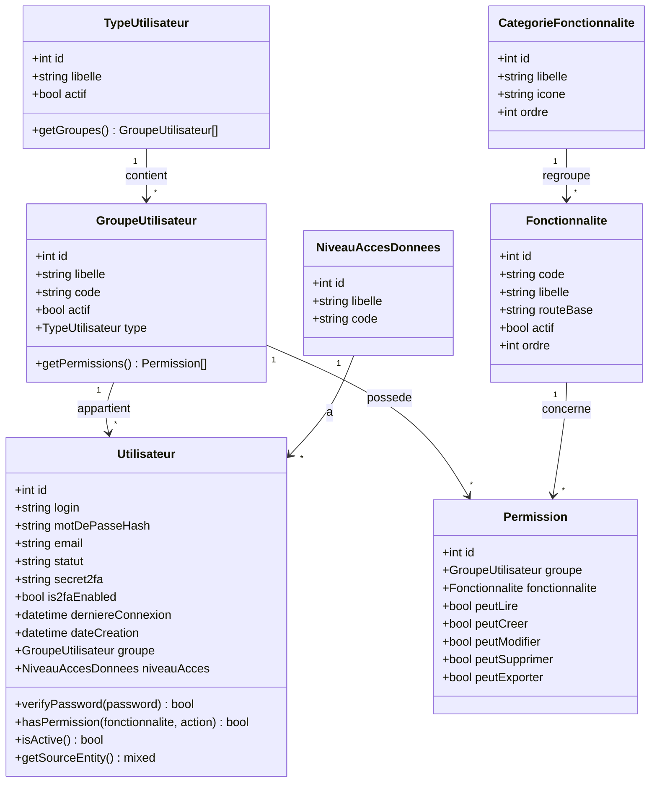
```mermaid
classDiagram
    direction TB
    
    class TypeUtilisateur {
        +int id
        +string libelle
        +bool actif
        +getGroupes() GroupeUtilisateur[]
    }
    
    class GroupeUtilisateur {
        +int id
        +string libelle
        +string code
        +bool actif
        +TypeUtilisateur type
        +getPermissions() Permission[]
    }
    
    class NiveauAccesDonnees {
        +int id
        +string libelle
        +string code
    }
    
    class Utilisateur {
        +int id
        +string login
        +string motDePasseHash
        +string email
        +string statut
        +string secret2fa
        +bool is2faEnabled
        +datetime derniereConnexion
        +datetime dateCreation
        +GroupeUtilisateur groupe
        +NiveauAccesDonnees niveauAcces
        +verifyPassword(password) bool
        +hasPermission(fonctionnalite, action) bool
        +isActive() bool
        +getSourceEntity() mixed
    }
    
    class Permission {
        +int id
        +GroupeUtilisateur groupe
        +Fonctionnalite fonctionnalite
        +bool peutLire
        +bool peutCreer
        +bool peutModifier
        +bool peutSupprimer
        +bool peutExporter
    }
    
    class Fonctionnalite {
        +int id
        +string code
        +string libelle
        +string routeBase
        +bool actif
        +int ordre
    }
    
    class CategorieFonctionnalite {
        +int id
        +string libelle
        +string icone
        +int ordre
    }
    
    TypeUtilisateur "1" --> "*" GroupeUtilisateur : contient
    GroupeUtilisateur "1" --> "*" Utilisateur : appartient
    NiveauAccesDonnees "1" --> "*" Utilisateur : a
    GroupeUtilisateur "1" --> "*" Permission : possede
    Fonctionnalite "1" --> "*" Permission : concerne
    CategorieFonctionnalite "1" --> "*" Fonctionnalite : regroupe
```

### 1.2 Package Student (Etudiants)

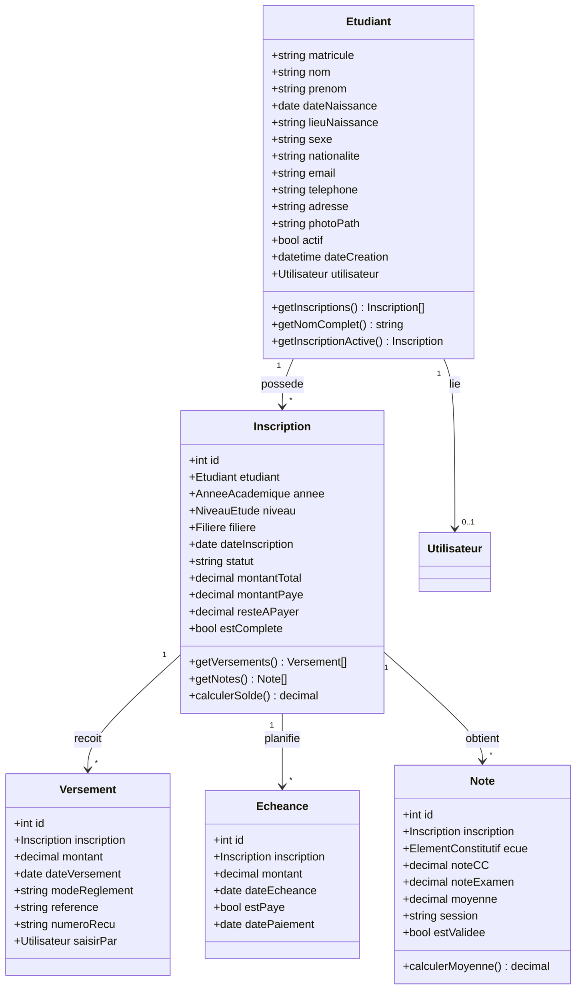
```mermaid
classDiagram
    direction TB
    
    class Etudiant {
        +string matricule
        +string nom
        +string prenom
        +date dateNaissance
        +string lieuNaissance
        +string sexe
        +string nationalite
        +string email
        +string telephone
        +string adresse
        +string photoPath
        +bool actif
        +datetime dateCreation
        +Utilisateur utilisateur
        +getInscriptions() Inscription[]
        +getNomComplet() string
        +getInscriptionActive() Inscription
    }
    
    class Inscription {
        +int id
        +Etudiant etudiant
        +AnneeAcademique annee
        +NiveauEtude niveau
        +Filiere filiere
        +date dateInscription
        +string statut
        +decimal montantTotal
        +decimal montantPaye
        +decimal resteAPayer
        +bool estComplete
        +getVersements() Versement[]
        +getNotes() Note[]
        +calculerSolde() decimal
    }
    
    class Versement {
        +int id
        +Inscription inscription
        +decimal montant
        +date dateVersement
        +string modeReglement
        +string reference
        +string numeroRecu
        +Utilisateur saisirPar
    }
    
    class Echeance {
        +int id
        +Inscription inscription
        +decimal montant
        +date dateEcheance
        +bool estPaye
        +date datePaiement
    }
    
    class Note {
        +int id
        +Inscription inscription
        +ElementConstitutif ecue
        +decimal noteCC
        +decimal noteExamen
        +decimal moyenne
        +string session
        +bool estValidee
        +calculerMoyenne() decimal
    }
    
    Etudiant "1" --> "*" Inscription : possede
    Etudiant "1" --> "0..1" Utilisateur : lie
    Inscription "1" --> "*" Versement : recoit
    Inscription "1" --> "*" Echeance : planifie
    Inscription "1" --> "*" Note : obtient
```

### 1.3 Package Academic (Structure Pedagogique)

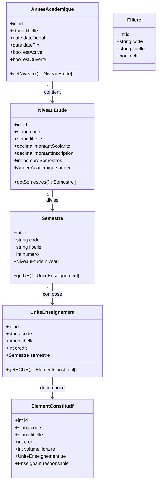
```mermaid
classDiagram
    direction TB
    
    class AnneeAcademique {
        +int id
        +string libelle
        +date dateDebut
        +date dateFin
        +bool estActive
        +bool estOuverte
        +getNiveaux() NiveauEtude[]
    }
    
    class NiveauEtude {
        +int id
        +string code
        +string libelle
        +decimal montantScolarite
        +decimal montantInscription
        +int nombreSemestres
        +AnneeAcademique annee
        +getSemestres() Semestre[]
    }
    
    class Semestre {
        +int id
        +string code
        +string libelle
        +int numero
        +NiveauEtude niveau
        +getUE() UniteEnseignement[]
    }
    
    class Filiere {
        +int id
        +string code
        +string libelle
        +bool actif
    }
    
    class UniteEnseignement {
        +int id
        +string code
        +string libelle
        +int credit
        +Semestre semestre
        +getECUE() ElementConstitutif[]
    }
    
    class ElementConstitutif {
        +int id
        +string code
        +string libelle
        +int credit
        +int volumeHoraire
        +UniteEnseignement ue
        +Enseignant responsable
    }
    
    AnneeAcademique "1" --> "*" NiveauEtude : contient
    NiveauEtude "1" --> "*" Semestre : divise
    Semestre "1" --> "*" UniteEnseignement : compose
    UniteEnseignement "1" --> "*" ElementConstitutif : decompose
```

### 1.4 Package Staff (Personnel)

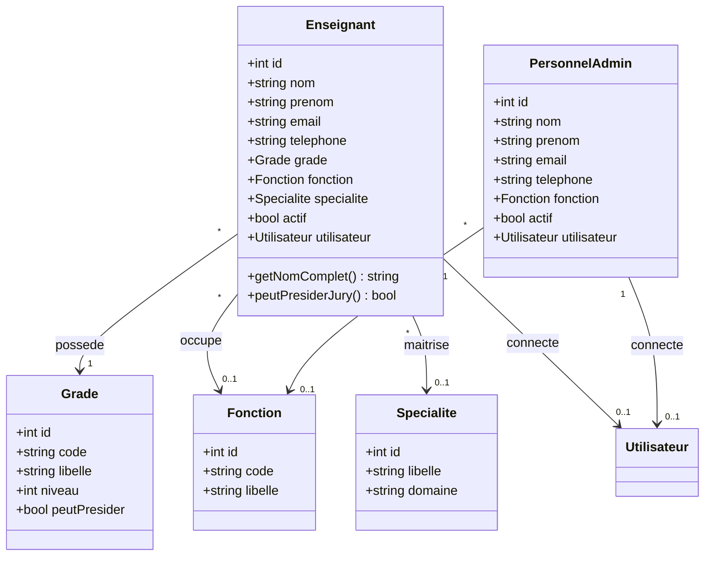
```mermaid
classDiagram
    direction TB
    
    class Enseignant {
        +int id
        +string nom
        +string prenom
        +string email
        +string telephone
        +Grade grade
        +Fonction fonction
        +Specialite specialite
        +bool actif
        +Utilisateur utilisateur
        +getNomComplet() string
        +peutPresiderJury() bool
    }
    
    class PersonnelAdmin {
        +int id
        +string nom
        +string prenom
        +string email
        +string telephone
        +Fonction fonction
        +bool actif
        +Utilisateur utilisateur
    }
    
    class Grade {
        +int id
        +string code
        +string libelle
        +int niveau
        +bool peutPresider
    }
    
    class Fonction {
        +int id
        +string code
        +string libelle
    }
    
    class Specialite {
        +int id
        +string libelle
        +string domaine
    }
    
    Enseignant "*" --> "1" Grade : possede
    Enseignant "*" --> "0..1" Fonction : occupe
    Enseignant "*" --> "0..1" Specialite : maitrise
    PersonnelAdmin "*" --> "0..1" Fonction : occupe
    Enseignant "1" --> "0..1" Utilisateur : connecte
    PersonnelAdmin "1" --> "0..1" Utilisateur : connecte
```

### 1.5 Package Stage (Candidature et Entreprise)

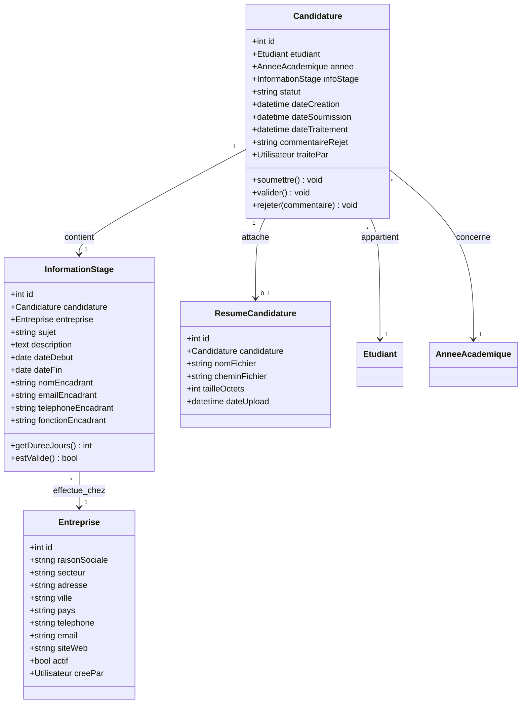
```mermaid
classDiagram
    direction TB
    
    class Candidature {
        +int id
        +Etudiant etudiant
        +AnneeAcademique annee
        +InformationStage infoStage
        +string statut
        +datetime dateCreation
        +datetime dateSoumission
        +datetime dateTraitement
        +string commentaireRejet
        +Utilisateur traitePar
        +soumettre() void
        +valider() void
        +rejeter(commentaire) void
    }
    
    class InformationStage {
        +int id
        +Candidature candidature
        +Entreprise entreprise
        +string sujet
        +text description
        +date dateDebut
        +date dateFin
        +string nomEncadrant
        +string emailEncadrant
        +string telephoneEncadrant
        +string fonctionEncadrant
        +getDureeJours() int
        +estValide() bool
    }
    
    class Entreprise {
        +int id
        +string raisonSociale
        +string secteur
        +string adresse
        +string ville
        +string pays
        +string telephone
        +string email
        +string siteWeb
        +bool actif
        +Utilisateur creePar
    }
    
    class ResumeCandidature {
        +int id
        +Candidature candidature
        +string nomFichier
        +string cheminFichier
        +int tailleOctets
        +datetime dateUpload
    }
    
    Candidature "1" --> "1" InformationStage : contient
    Candidature "1" --> "0..1" ResumeCandidature : attache
    InformationStage "*" --> "1" Entreprise : effectue_chez
    Candidature "*" --> "1" Etudiant : appartient
    Candidature "*" --> "1" AnneeAcademique : concerne
```

### 1.6 Package Report (Rapport de Stage)

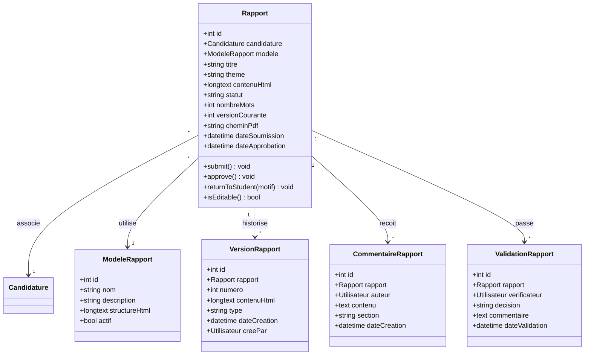
```mermaid
classDiagram
    direction TB
    
    class Rapport {
        +int id
        +Candidature candidature
        +ModeleRapport modele
        +string titre
        +string theme
        +longtext contenuHtml
        +string statut
        +int nombreMots
        +int versionCourante
        +string cheminPdf
        +datetime dateSoumission
        +datetime dateApprobation
        +submit() void
        +approve() void
        +returnToStudent(motif) void
        +isEditable() bool
    }
    
    class VersionRapport {
        +int id
        +Rapport rapport
        +int numero
        +longtext contenuHtml
        +string type
        +datetime dateCreation
        +Utilisateur creePar
    }
    
    class ModeleRapport {
        +int id
        +string nom
        +string description
        +longtext structureHtml
        +bool actif
    }
    
    class CommentaireRapport {
        +int id
        +Rapport rapport
        +Utilisateur auteur
        +text contenu
        +string section
        +datetime dateCreation
    }
    
    class ValidationRapport {
        +int id
        +Rapport rapport
        +Utilisateur verificateur
        +string decision
        +text commentaire
        +datetime dateValidation
    }
    
    Rapport "*" --> "1" Candidature : associe
    Rapport "*" --> "1" ModeleRapport : utilise
    Rapport "1" --> "*" VersionRapport : historise
    Rapport "1" --> "*" CommentaireRapport : recoit
    Rapport "1" --> "*" ValidationRapport : passe
```

### 1.7 Package Commission

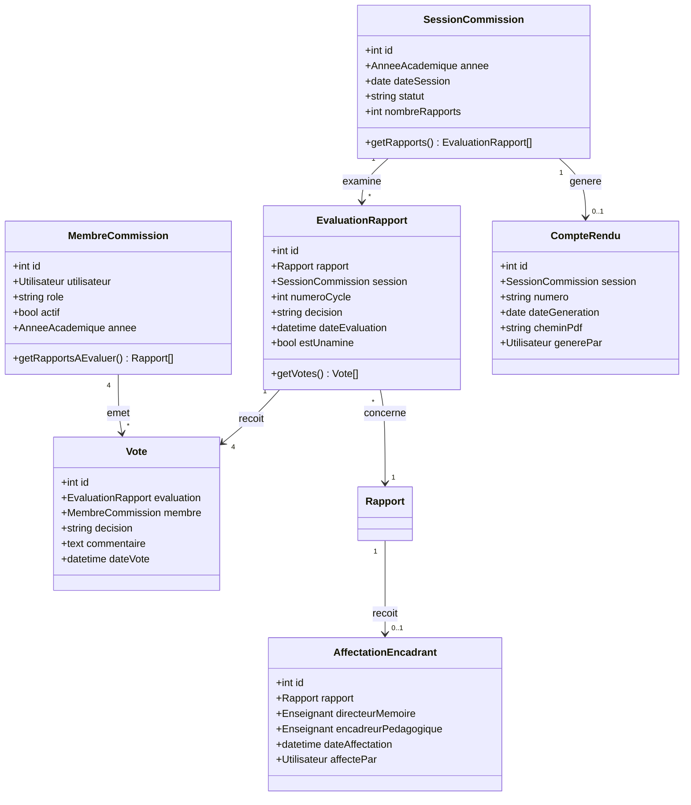
```mermaid
classDiagram
    direction TB
    
    class MembreCommission {
        +int id
        +Utilisateur utilisateur
        +string role
        +bool actif
        +AnneeAcademique annee
        +getRapportsAEvaluer() Rapport[]
    }
    
    class SessionCommission {
        +int id
        +AnneeAcademique annee
        +date dateSession
        +string statut
        +int nombreRapports
        +getRapports() EvaluationRapport[]
    }
    
    class EvaluationRapport {
        +int id
        +Rapport rapport
        +SessionCommission session
        +int numeroCycle
        +string decision
        +datetime dateEvaluation
        +bool estUnamine
        +getVotes() Vote[]
    }
    
    class Vote {
        +int id
        +EvaluationRapport evaluation
        +MembreCommission membre
        +string decision
        +text commentaire
        +datetime dateVote
    }
    
    class AffectationEncadrant {
        +int id
        +Rapport rapport
        +Enseignant directeurMemoire
        +Enseignant encadreurPedagogique
        +datetime dateAffectation
        +Utilisateur affectePar
    }
    
    class CompteRendu {
        +int id
        +SessionCommission session
        +string numero
        +date dateGeneration
        +string cheminPdf
        +Utilisateur generePar
    }
    
    MembreCommission "4" --> "*" Vote : emet
    SessionCommission "1" --> "*" EvaluationRapport : examine
    EvaluationRapport "1" --> "4" Vote : recoit
    EvaluationRapport "*" --> "1" Rapport : concerne
    Rapport "1" --> "0..1" AffectationEncadrant : recoit
    SessionCommission "1" --> "0..1" CompteRendu : genere
```

### 1.8 Package Soutenance

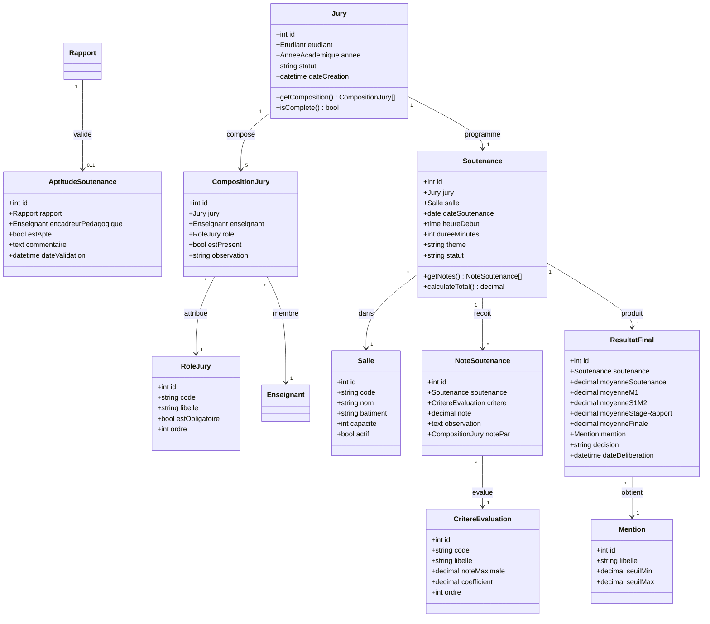
```mermaid
classDiagram
    direction TB
    
    class AptitudeSoutenance {
        +int id
        +Rapport rapport
        +Enseignant encadreurPedagogique
        +bool estApte
        +text commentaire
        +datetime dateValidation
    }
    
    class Jury {
        +int id
        +Etudiant etudiant
        +AnneeAcademique annee
        +string statut
        +datetime dateCreation
        +getComposition() CompositionJury[]
        +isComplete() bool
    }
    
    class RoleJury {
        +int id
        +string code
        +string libelle
        +bool estObligatoire
        +int ordre
    }
    
    class CompositionJury {
        +int id
        +Jury jury
        +Enseignant enseignant
        +RoleJury role
        +bool estPresent
        +string observation
    }
    
    class Salle {
        +int id
        +string code
        +string nom
        +string batiment
        +int capacite
        +bool actif
    }
    
    class Soutenance {
        +int id
        +Jury jury
        +Salle salle
        +date dateSoutenance
        +time heureDebut
        +int dureeMinutes
        +string theme
        +string statut
        +getNotes() NoteSoutenance[]
        +calculateTotal() decimal
    }
    
    class CritereEvaluation {
        +int id
        +string code
        +string libelle
        +decimal noteMaximale
        +decimal coefficient
        +int ordre
    }
    
    class NoteSoutenance {
        +int id
        +Soutenance soutenance
        +CritereEvaluation critere
        +decimal note
        +text observation
        +CompositionJury notePar
    }
    
    class ResultatFinal {
        +int id
        +Soutenance soutenance
        +decimal moyenneSoutenance
        +decimal moyenneM1
        +decimal moyenneS1M2
        +decimal moyenneStageRapport
        +decimal moyenneFinale
        +Mention mention
        +string decision
        +datetime dateDeliberation
    }
    
    class Mention {
        +int id
        +string libelle
        +decimal seuilMin
        +decimal seuilMax
    }
    
    Jury "1" --> "5" CompositionJury : compose
    CompositionJury "*" --> "1" RoleJury : attribue
    CompositionJury "*" --> "1" Enseignant : membre
    Jury "1" --> "1" Soutenance : programme
    Soutenance "*" --> "1" Salle : dans
    Soutenance "1" --> "*" NoteSoutenance : recoit
    NoteSoutenance "*" --> "1" CritereEvaluation : evalue
    Soutenance "1" --> "1" ResultatFinal : produit
    ResultatFinal "*" --> "1" Mention : obtient
    Rapport "1" --> "0..1" AptitudeSoutenance : valide
```

---

## 2. Diagramme Entite-Relation (ERD)

### 2.1 ERD Global Simplifie

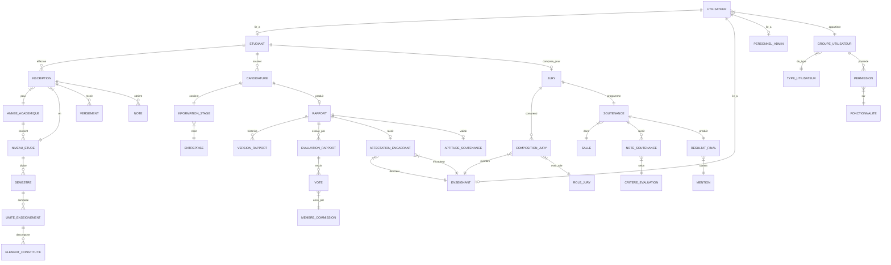
```mermaid
erDiagram
    UTILISATEUR ||--o| ETUDIANT : "lie_a"
    UTILISATEUR ||--o| ENSEIGNANT : "lie_a"
    UTILISATEUR ||--o| PERSONNEL_ADMIN : "lie_a"
    UTILISATEUR }|--|| GROUPE_UTILISATEUR : "appartient"
    GROUPE_UTILISATEUR }|--|| TYPE_UTILISATEUR : "de_type"
    GROUPE_UTILISATEUR ||--o{ PERMISSION : "possede"
    PERMISSION }|--|| FONCTIONNALITE : "sur"
    
    ETUDIANT ||--o{ INSCRIPTION : "effectue"
    INSCRIPTION }|--|| ANNEE_ACADEMIQUE : "pour"
    INSCRIPTION }|--|| NIVEAU_ETUDE : "en"
    INSCRIPTION ||--o{ VERSEMENT : "recoit"
    INSCRIPTION ||--o{ NOTE : "obtient"
    
    ANNEE_ACADEMIQUE ||--o{ NIVEAU_ETUDE : "contient"
    NIVEAU_ETUDE ||--o{ SEMESTRE : "divise"
    SEMESTRE ||--o{ UNITE_ENSEIGNEMENT : "compose"
    UNITE_ENSEIGNEMENT ||--o{ ELEMENT_CONSTITUTIF : "decompose"
    
    ETUDIANT ||--o{ CANDIDATURE : "soumet"
    CANDIDATURE ||--|| INFORMATION_STAGE : "contient"
    INFORMATION_STAGE }|--|| ENTREPRISE : "chez"
    CANDIDATURE ||--o| RAPPORT : "produit"
    
    RAPPORT ||--o{ VERSION_RAPPORT : "historise"
    RAPPORT ||--o{ EVALUATION_RAPPORT : "evalue_par"
    EVALUATION_RAPPORT ||--o{ VOTE : "recoit"
    VOTE }|--|| MEMBRE_COMMISSION : "emis_par"
    
    RAPPORT ||--o| AFFECTATION_ENCADRANT : "recoit"
    AFFECTATION_ENCADRANT }|--|| ENSEIGNANT : "directeur"
    AFFECTATION_ENCADRANT }|--|| ENSEIGNANT : "encadreur"
    
    RAPPORT ||--o| APTITUDE_SOUTENANCE : "valide"
    ETUDIANT ||--o| JURY : "compose_pour"
    JURY ||--o{ COMPOSITION_JURY : "comprend"
    COMPOSITION_JURY }|--|| ENSEIGNANT : "membre"
    COMPOSITION_JURY }|--|| ROLE_JURY : "avec_role"
    
    JURY ||--|| SOUTENANCE : "programme"
    SOUTENANCE }|--|| SALLE : "dans"
    SOUTENANCE ||--o{ NOTE_SOUTENANCE : "recoit"
    NOTE_SOUTENANCE }|--|| CRITERE_EVALUATION : "selon"
    SOUTENANCE ||--|| RESULTAT_FINAL : "produit"
    RESULTAT_FINAL }|--|| MENTION : "obtient"
```

### 2.2 ERD Module Utilisateurs (Detail)

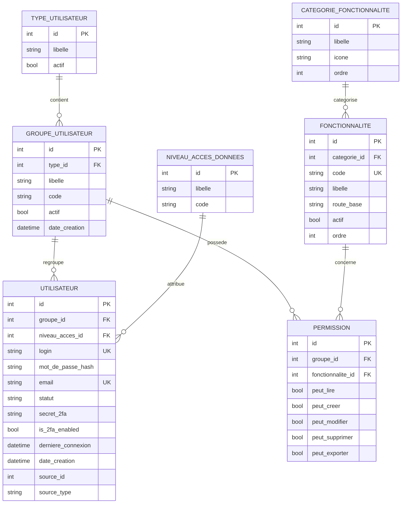
```mermaid
erDiagram
    TYPE_UTILISATEUR {
        int id PK
        string libelle
        bool actif
    }
    
    GROUPE_UTILISATEUR {
        int id PK
        int type_id FK
        string libelle
        string code
        bool actif
        datetime date_creation
    }
    
    NIVEAU_ACCES_DONNEES {
        int id PK
        string libelle
        string code
    }
    
    UTILISATEUR {
        int id PK
        int groupe_id FK
        int niveau_acces_id FK
        string login UK
        string mot_de_passe_hash
        string email UK
        string statut
        string secret_2fa
        bool is_2fa_enabled
        datetime derniere_connexion
        datetime date_creation
        int source_id
        string source_type
    }
    
    CATEGORIE_FONCTIONNALITE {
        int id PK
        string libelle
        string icone
        int ordre
    }
    
    FONCTIONNALITE {
        int id PK
        int categorie_id FK
        string code UK
        string libelle
        string route_base
        bool actif
        int ordre
    }
    
    PERMISSION {
        int id PK
        int groupe_id FK
        int fonctionnalite_id FK
        bool peut_lire
        bool peut_creer
        bool peut_modifier
        bool peut_supprimer
        bool peut_exporter
    }
    
    TYPE_UTILISATEUR ||--o{ GROUPE_UTILISATEUR : "contient"
    GROUPE_UTILISATEUR ||--o{ UTILISATEUR : "regroupe"
    NIVEAU_ACCES_DONNEES ||--o{ UTILISATEUR : "attribue"
    CATEGORIE_FONCTIONNALITE ||--o{ FONCTIONNALITE : "categorise"
    GROUPE_UTILISATEUR ||--o{ PERMISSION : "possede"
    FONCTIONNALITE ||--o{ PERMISSION : "concerne"
```

### 2.3 ERD Module Stages et Rapports (Detail)

```mermaid
erDiagram
    ENTREPRISE {
        int id PK
        string raison_sociale
        string secteur
        text adresse
        string ville
        string pays
        string telephone
        string email
        string site_web
        bool actif
    }
    
    CANDIDATURE {
        int id PK
        string matricule_etudiant FK
        int annee_id FK
        string statut
        datetime date_creation
        datetime date_soumission
        datetime date_traitement
        text commentaire_rejet
        int traite_par FK
    }
    
    INFORMATION_STAGE {
        int id PK
        int candidature_id FK UK
        int entreprise_id FK
        string sujet
        text description
        date date_debut
        date date_fin
        string nom_encadrant
        string email_encadrant
        string telephone_encadrant
        string fonction_encadrant
    }
    
    MODELE_RAPPORT {
        int id PK
        string nom
        text description
        longtext structure_html
        bool actif
    }
    
    RAPPORT {
        int id PK
        int candidature_id FK UK
        int modele_id FK
        string titre
        string theme
        longtext contenu_html
        string statut
        int nombre_mots
        int version_courante
        string chemin_pdf
        datetime date_soumission
        datetime date_approbation
    }
    
    VERSION_RAPPORT {
        int id PK
        int rapport_id FK
        int numero
        longtext contenu_html
        string type
        datetime date_creation
        int cree_par FK
    }
    
    ENTREPRISE ||--o{ INFORMATION_STAGE : "accueille"
    CANDIDATURE ||--|| INFORMATION_STAGE : "contient"
    CANDIDATURE ||--o| RAPPORT : "produit"
    MODELE_RAPPORT ||--o{ RAPPORT : "structure"
    RAPPORT ||--o{ VERSION_RAPPORT : "historise"
```

---

## 3. Diagrammes d'Etats (State Machine)

### 3.1 Etats de la Candidature

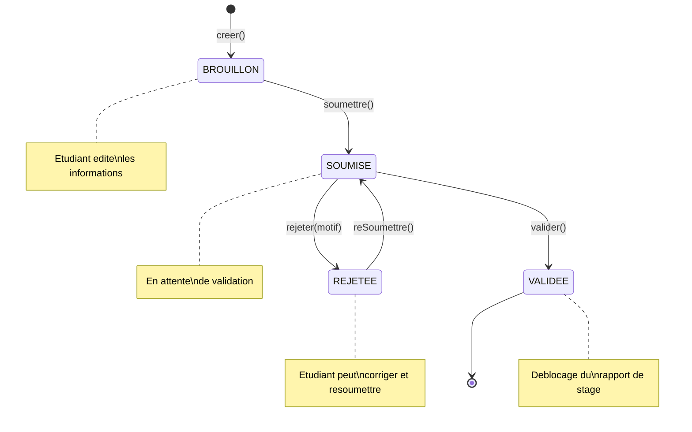
```mermaid
stateDiagram-v2
    [*] --> BROUILLON : creer()
    
    BROUILLON --> SOUMISE : soumettre()
    note right of BROUILLON : Etudiant edite\nles informations
    
    SOUMISE --> VALIDEE : valider()
    SOUMISE --> REJETEE : rejeter(motif)
    note right of SOUMISE : En attente\nde validation
    
    REJETEE --> SOUMISE : reSoumettre()
    note right of REJETEE : Etudiant peut\ncorriger et resoumettre
    
    VALIDEE --> [*]
    note right of VALIDEE : Deblocage du\nrapport de stage
```

### 3.2 Etats du Rapport

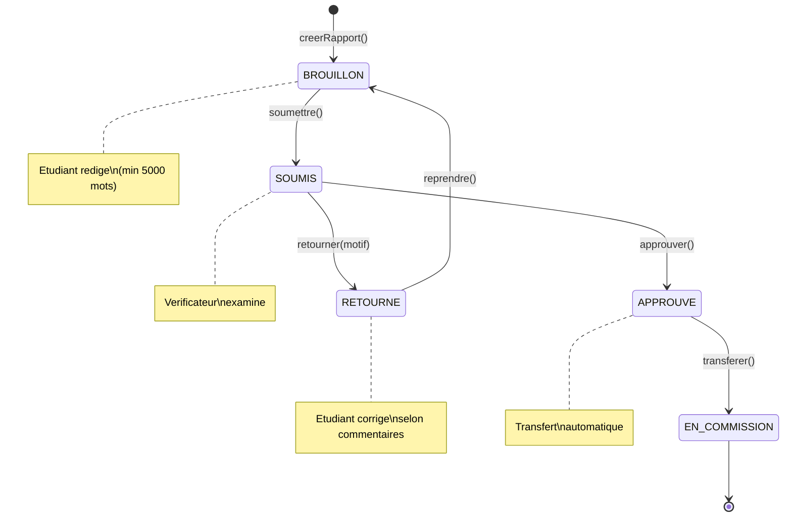
```mermaid
stateDiagram-v2
    [*] --> BROUILLON : creerRapport()
    
    BROUILLON --> SOUMIS : soumettre()
    note right of BROUILLON : Etudiant redige\n(min 5000 mots)
    
    SOUMIS --> APPROUVE : approuver()
    SOUMIS --> RETOURNE : retourner(motif)
    note right of SOUMIS : Verificateur\nexamine
    
    RETOURNE --> BROUILLON : reprendre()
    note right of RETOURNE : Etudiant corrige\nselon commentaires
    
    APPROUVE --> EN_COMMISSION : transferer()
    note right of APPROUVE : Transfert\nautomatique
    
    EN_COMMISSION --> [*]
```

### 3.3 Etats du Rapport en Commission

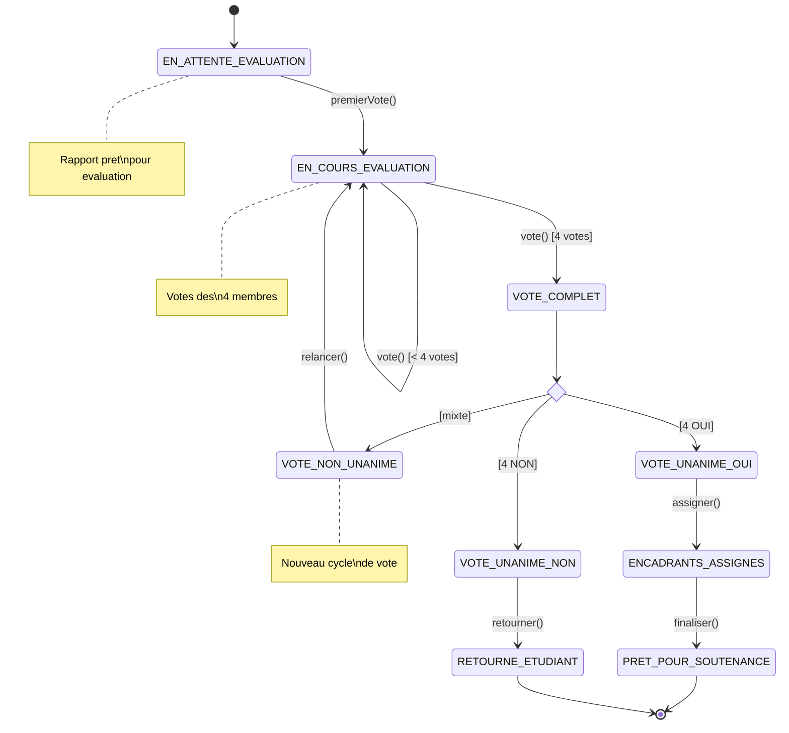
```mermaid
stateDiagram-v2
    [*] --> EN_ATTENTE_EVALUATION
    
    EN_ATTENTE_EVALUATION --> EN_COURS_EVALUATION : premierVote()
    note right of EN_ATTENTE_EVALUATION : Rapport pret\npour evaluation
    
    EN_COURS_EVALUATION --> EN_COURS_EVALUATION : vote() [< 4 votes]
    EN_COURS_EVALUATION --> VOTE_COMPLET : vote() [4 votes]
    note right of EN_COURS_EVALUATION : Votes des\n4 membres
    
    state choix_decision <<choice>>
    VOTE_COMPLET --> choix_decision
    
    choix_decision --> VOTE_UNANIME_OUI : [4 OUI]
    choix_decision --> VOTE_UNANIME_NON : [4 NON]
    choix_decision --> VOTE_NON_UNANIME : [mixte]
    
    VOTE_NON_UNANIME --> EN_COURS_EVALUATION : relancer()
    note right of VOTE_NON_UNANIME : Nouveau cycle\nde vote
    
    VOTE_UNANIME_OUI --> ENCADRANTS_ASSIGNES : assigner()
    VOTE_UNANIME_NON --> RETOURNE_ETUDIANT : retourner()
    
    ENCADRANTS_ASSIGNES --> PRET_POUR_SOUTENANCE : finaliser()
    
    PRET_POUR_SOUTENANCE --> [*]
    RETOURNE_ETUDIANT --> [*]
```

### 3.4 Etats de la Soutenance

```mermaid
stateDiagram-v2
    [*] --> ENCADRANTS_ASSIGNES
    note right of ENCADRANTS_ASSIGNES : Venant de\nla commission
    
    ENCADRANTS_ASSIGNES --> APTITUDE_VALIDEE : validerAptitude()
    note right of ENCADRANTS_ASSIGNES : Encadreur pedagogique\nevalue l'aptitude
    
    APTITUDE_VALIDEE --> JURY_COMPOSE : composerJury()
    note right of JURY_COMPOSE : 5 membres:\nPresident, Rapporteur,\nExaminateurs, etc.
    
    JURY_COMPOSE --> SOUTENANCE_PROGRAMMEE : programmer()
    note right of SOUTENANCE_PROGRAMMEE : Date, heure,\nsalle attribues
    
    SOUTENANCE_PROGRAMMEE --> SOUTENANCE_EFFECTUEE : marquerEffectuee()
    note right of SOUTENANCE_EFFECTUEE : Jour J passe
    
    SOUTENANCE_EFFECTUEE --> NOTES_SAISIES : saisirNotes()
    note right of NOTES_SAISIES : Notes par critere\npour chaque membre
    
    NOTES_SAISIES --> DELIBERE : deliberer()
    note right of DELIBERE : Calcul moyenne,\nmention, decision
    
    DELIBERE --> [*]
```

### 3.5 Cycle de Vie Complet (Workflow Global)

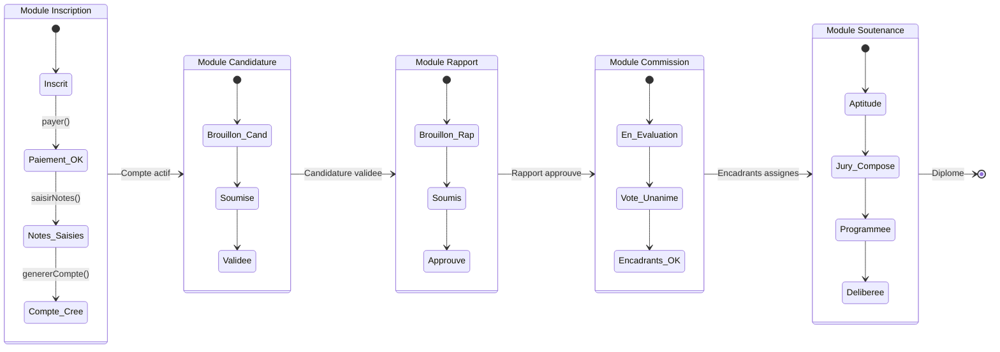
```mermaid
stateDiagram-v2
    direction LR
    
    state "Module Inscription" as M1 {
        [*] --> Inscrit
        Inscrit --> Paiement_OK : payer()
        Paiement_OK --> Notes_Saisies : saisirNotes()
        Notes_Saisies --> Compte_Cree : genererCompte()
    }
    
    state "Module Candidature" as M2 {
        [*] --> Brouillon_Cand
        Brouillon_Cand --> Soumise
        Soumise --> Validee
    }
    
    state "Module Rapport" as M3 {
        [*] --> Brouillon_Rap
        Brouillon_Rap --> Soumis
        Soumis --> Approuve
    }
    
    state "Module Commission" as M4 {
        [*] --> En_Evaluation
        En_Evaluation --> Vote_Unanime
        Vote_Unanime --> Encadrants_OK
    }
    
    state "Module Soutenance" as M5 {
        [*] --> Aptitude
        Aptitude --> Jury_Compose
        Jury_Compose --> Programmee
        Programmee --> Deliberee
    }
    
    M1 --> M2 : Compte actif
    M2 --> M3 : Candidature validee
    M3 --> M4 : Rapport approuve
    M4 --> M5 : Encadrants assignes
    M5 --> [*] : Diplome
```

---

## 4. Diagrammes de Sequence

### 4.1 Sequence : Authentification Utilisateur

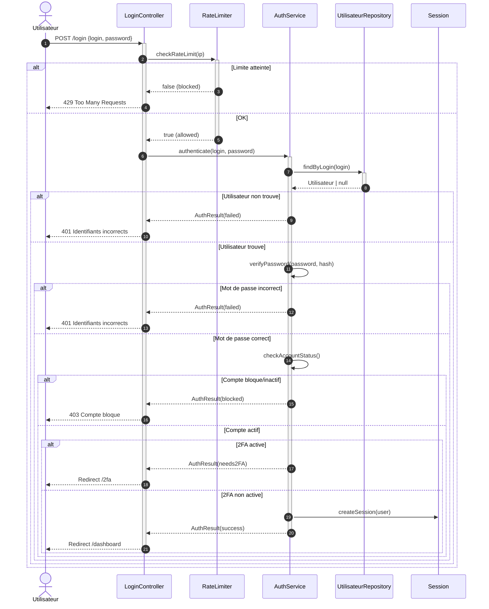
```mermaid
sequenceDiagram
    autonumber
    actor User as Utilisateur
    participant LC as LoginController
    participant RL as RateLimiter
    participant AS as AuthService
    participant UR as UtilisateurRepository
    participant Session
    
    User->>+LC: POST /login {login, password}
    LC->>+RL: checkRateLimit(ip)
    
    alt Limite atteinte
        RL-->>LC: false (blocked)
        LC-->>User: 429 Too Many Requests
    else OK
        RL-->>-LC: true (allowed)
        LC->>+AS: authenticate(login, password)
        AS->>+UR: findByLogin(login)
        UR-->>-AS: Utilisateur | null
        
        alt Utilisateur non trouve
            AS-->>LC: AuthResult(failed)
            LC-->>User: 401 Identifiants incorrects
        else Utilisateur trouve
            AS->>AS: verifyPassword(password, hash)
            
            alt Mot de passe incorrect
                AS-->>LC: AuthResult(failed)
                LC-->>User: 401 Identifiants incorrects
            else Mot de passe correct
                AS->>AS: checkAccountStatus()
                
                alt Compte bloque/inactif
                    AS-->>LC: AuthResult(blocked)
                    LC-->>User: 403 Compte bloque
                else Compte actif
                    alt 2FA active
                        AS-->>LC: AuthResult(needs2FA)
                        LC-->>User: Redirect /2fa
                    else 2FA non active
                        AS->>Session: createSession(user)
                        AS-->>-LC: AuthResult(success)
                        LC-->>-User: Redirect /dashboard
                    end
                end
            end
        end
    end
```

### 4.2 Sequence : Soumission de Candidature

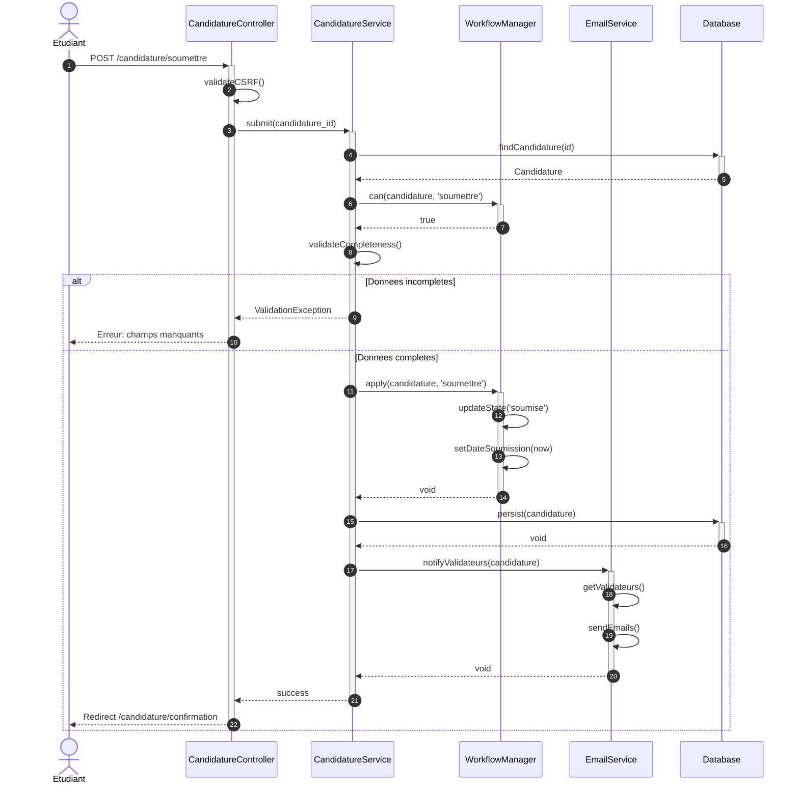
```mermaid
sequenceDiagram
    autonumber
    actor Etudiant
    participant CC as CandidatureController
    participant CS as CandidatureService
    participant WF as WorkflowManager
    participant ES as EmailService
    participant DB as Database
    
    Etudiant->>+CC: POST /candidature/soumettre
    CC->>CC: validateCSRF()
    CC->>+CS: submit(candidature_id)
    
    CS->>+DB: findCandidature(id)
    DB-->>-CS: Candidature
    
    CS->>+WF: can(candidature, 'soumettre')
    WF-->>-CS: true
    
    CS->>CS: validateCompleteness()
    
    alt Donnees incompletes
        CS-->>CC: ValidationException
        CC-->>Etudiant: Erreur: champs manquants
    else Donnees completes
        CS->>+WF: apply(candidature, 'soumettre')
        WF->>WF: updateState('soumise')
        WF->>WF: setDateSoumission(now)
        WF-->>-CS: void
        
        CS->>+DB: persist(candidature)
        DB-->>-CS: void
        
        CS->>+ES: notifyValidateurs(candidature)
        ES->>ES: getValidateurs()
        ES->>ES: sendEmails()
        ES-->>-CS: void
        
        CS-->>-CC: success
        CC-->>-Etudiant: Redirect /candidature/confirmation
    end
```

### 4.3 Sequence : Vote Commission (Cycle Complet)

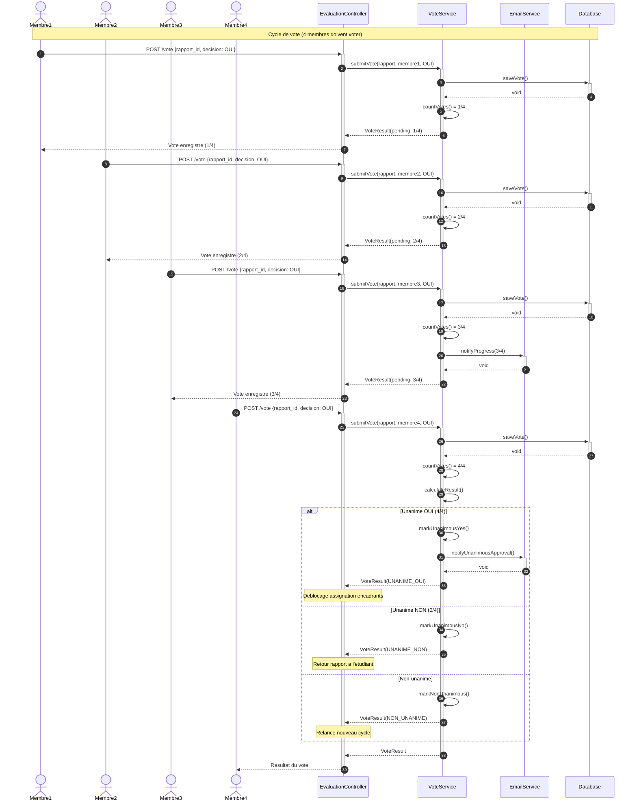
```mermaid
sequenceDiagram
    autonumber
    actor M1 as Membre1
    actor M2 as Membre2
    actor M3 as Membre3
    actor M4 as Membre4
    participant EC as EvaluationController
    participant VS as VoteService
    participant ES as EmailService
    participant DB as Database
    
    Note over M1,DB: Cycle de vote (4 membres doivent voter)
    
    M1->>+EC: POST /vote {rapport_id, decision: OUI}
    EC->>+VS: submitVote(rapport, membre1, OUI)
    VS->>+DB: saveVote()
    DB-->>-VS: void
    VS->>VS: countVotes() = 1/4
    VS-->>-EC: VoteResult(pending, 1/4)
    EC-->>-M1: Vote enregistre (1/4)
    
    M2->>+EC: POST /vote {rapport_id, decision: OUI}
    EC->>+VS: submitVote(rapport, membre2, OUI)
    VS->>+DB: saveVote()
    DB-->>-VS: void
    VS->>VS: countVotes() = 2/4
    VS-->>-EC: VoteResult(pending, 2/4)
    EC-->>-M2: Vote enregistre (2/4)
    
    M3->>+EC: POST /vote {rapport_id, decision: OUI}
    EC->>+VS: submitVote(rapport, membre3, OUI)
    VS->>+DB: saveVote()
    DB-->>-VS: void
    VS->>VS: countVotes() = 3/4
    VS->>+ES: notifyProgress(3/4)
    ES-->>-VS: void
    VS-->>-EC: VoteResult(pending, 3/4)
    EC-->>-M3: Vote enregistre (3/4)
    
    M4->>+EC: POST /vote {rapport_id, decision: OUI}
    EC->>+VS: submitVote(rapport, membre4, OUI)
    VS->>+DB: saveVote()
    DB-->>-VS: void
    VS->>VS: countVotes() = 4/4
    VS->>VS: calculateResult()
    
    alt Unanime OUI (4/4)
        VS->>VS: markUnanimousYes()
        VS->>+ES: notifyUnanimousApproval()
        ES-->>-VS: void
        VS-->>EC: VoteResult(UNANIME_OUI)
        Note over EC: Deblocage assignation encadrants
    else Unanime NON (0/4)
        VS->>VS: markUnanimousNo()
        VS-->>EC: VoteResult(UNANIME_NON)
        Note over EC: Retour rapport a l'etudiant
    else Non-unanime
        VS->>VS: markNonUnanimous()
        VS-->>EC: VoteResult(NON_UNANIME)
        Note over EC: Relance nouveau cycle
    end
    
    VS-->>-EC: VoteResult
    EC-->>-M4: Resultat du vote
```

### 4.4 Sequence : Deliberation et Generation PV

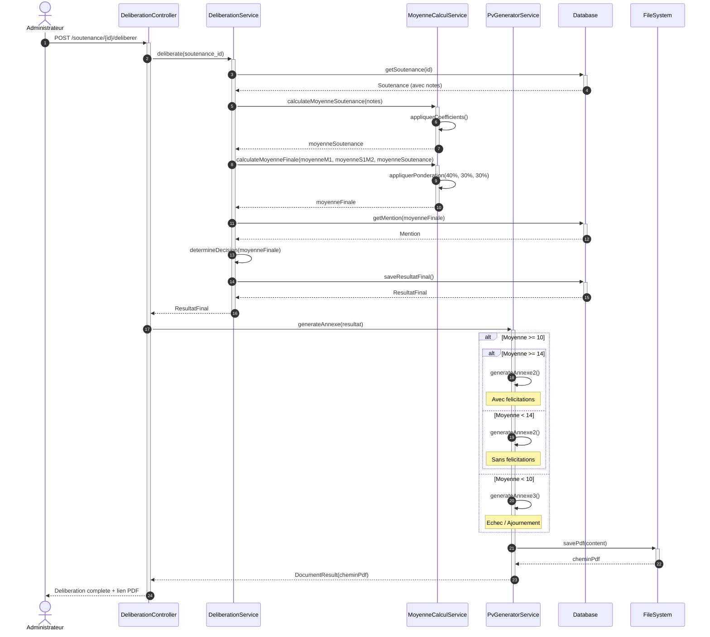
```mermaid
sequenceDiagram
    autonumber
    actor Admin as Administrateur
    participant DC as DeliberationController
    participant DS as DeliberationService
    participant MCS as MoyenneCalculService
    participant PG as PvGeneratorService
    participant DB as Database
    participant FS as FileSystem
    
    Admin->>+DC: POST /soutenance/{id}/deliberer
    DC->>+DS: deliberate(soutenance_id)
    
    DS->>+DB: getSoutenance(id)
    DB-->>-DS: Soutenance (avec notes)
    
    DS->>+MCS: calculateMoyenneSoutenance(notes)
    MCS->>MCS: appliquerCoefficients()
    MCS-->>-DS: moyenneSoutenance
    
    DS->>+MCS: calculateMoyenneFinale(moyenneM1, moyenneS1M2, moyenneSoutenance)
    MCS->>MCS: appliquerPonderation(40%, 30%, 30%)
    MCS-->>-DS: moyenneFinale
    
    DS->>+DB: getMention(moyenneFinale)
    DB-->>-DS: Mention
    
    DS->>DS: determineDecision(moyenneFinale)
    
    DS->>+DB: saveResultatFinal()
    DB-->>-DS: ResultatFinal
    
    DS-->>-DC: ResultatFinal
    
    DC->>+PG: generateAnnexe(resultat)
    
    alt Moyenne >= 10
        alt Moyenne >= 14
            PG->>PG: generateAnnexe2() 
            Note over PG: Avec felicitations
        else Moyenne < 14
            PG->>PG: generateAnnexe2()
            Note over PG: Sans felicitations
        end
    else Moyenne < 10
        PG->>PG: generateAnnexe3()
        Note over PG: Echec / Ajournement
    end
    
    PG->>+FS: savePdf(content)
    FS-->>-PG: cheminPdf
    
    PG-->>-DC: DocumentResult(cheminPdf)
    
    DC-->>-Admin: Deliberation complete + lien PDF
```

### 4.5 Sequence : Generation Bulletin de Notes

```mermaid
sequenceDiagram
    autonumber
    actor Admin as Administrateur
    participant DC as DocumentController
    participant BG as BulletinGeneratorService
    participant NR as NoteRepository
    participant PG as PdfGenerator
    participant FS as FileSystem
    
    Admin->>+DC: GET /etudiant/{matricule}/bulletin
    
    DC->>DC: checkPermission('documents', 'exporter')
    
    DC->>+BG: generateBulletin(matricule, annee, semestre)
    
    BG->>+NR: getNotesByInscription(matricule, annee)
    NR-->>-BG: Note[]
    
    BG->>BG: calculateMoyenneParUE()
    BG->>BG: calculateMoyenneGenerale()
    BG->>BG: determineCreditsValides()
    
    BG->>+PG: createPdf()
    PG->>PG: loadTemplate('bulletin.php')
    PG->>PG: injectData(notes, moyennes, credits)
    PG->>PG: addHeader(logos, titres)
    PG->>PG: addFooter(date, signature)
    PG-->>-BG: PdfContent
    
    BG->>+FS: savePdf(content, path)
    FS-->>-BG: filePath
    
    BG->>+DB: logGeneration(document)
    DB-->>-BG: void
    
    BG-->>-DC: DocumentResult(filePath)
    
    DC-->>-Admin: PDF Download Response
```

---

## 5. Diagrammes d'Architecture

### 5.1 Diagramme de Composants

```mermaid
flowchart TB
    subgraph Presentation["Couche Presentation"]
        Controllers[Controllers]
        Templates[Templates PHP]
        Assets[Assets CSS/JS]
    end
    
    subgraph Business["Couche Metier"]
        Services[Services]
        Validators[Validators]
        Workflows[Symfony Workflow]
        Events[Event System]
    end
    
    subgraph Persistence["Couche Persistence"]
        Repositories[Repositories]
        Entities[Entities Doctrine]
        Migrations[Phinx Migrations]
    end
    
    subgraph Infrastructure["Infrastructure"]
        Router[FastRoute]
        DI[PHP-DI Container]
        Middlewares[PSR-15 Middlewares]
    end
    
    subgraph External["Services Externes"]
        Email[PHPMailer]
        PDF[TCPDF]
        Cache[APCu/File Cache]
    end
    
    subgraph Data["Stockage"]
        MySQL[(MySQL 8.0)]
        Files[(Fichiers)]
    end
    
    Controllers --> Services
    Controllers --> Templates
    Services --> Repositories
    Services --> Validators
    Services --> Workflows
    Services --> Events
    Repositories --> Entities
    Entities --> MySQL
    Services --> Email
    Services --> PDF
    Services --> Cache
    PDF --> Files
    
    Router --> Controllers
    DI --> Services
    Middlewares --> Controllers
```

### 5.2 Diagramme de Deploiement

```mermaid
flowchart TB
    subgraph Client["Navigateur Client"]
        Browser[Chrome/Firefox/Safari]
    end
    
    subgraph Server["Serveur Mutualise"]
        subgraph Apache["Apache HTTP Server"]
            htaccess[.htaccess]
            modphp[mod_php 8.4]
        end
        
        subgraph App["Application MIAGE"]
            public[public/index.php]
            src[src/]
            templates[templates/]
            config[config/]
            vendor[vendor/]
        end
        
        subgraph Storage["Storage"]
            logs[logs/]
            cache[cache/]
            documents[documents/]
            uploads[uploads/]
        end
        
        subgraph DB["Base de Donnees"]
            mysql[(MySQL 8.0+)]
        end
    end
    
    subgraph SMTP["Service Email"]
        smtp[Serveur SMTP]
    end
    
    Browser -->|HTTPS| htaccess
    htaccess -->|rewrite| modphp
    modphp --> public
    public --> src
    src --> templates
    src --> config
    src --> vendor
    src --> Storage
    src --> mysql
    src -->|PHPMailer| smtp
```

### 5.3 Flux de Donnees Global

```mermaid
flowchart LR
    subgraph Input["Entrees"]
        E1[Inscription Etudiant]
        E2[Candidature Stage]
        E3[Rapport de Stage]
        E4[Votes Commission]
        E5[Notes Soutenance]
    end
    
    subgraph Process["Traitements"]
        P1[Validation Donnees]
        P2[Workflow Transitions]
        P3[Calculs Moyennes]
        P4[Deliberations]
    end
    
    subgraph Output["Sorties"]
        O1[Recus PDF]
        O2[Bulletins PDF]
        O3[PV Commission PDF]
        O4[Annexes 1/2/3 PDF]
        O5[Notifications Email]
    end
    
    E1 --> P1
    E2 --> P1
    E3 --> P1
    E4 --> P2
    E5 --> P3
    
    P1 --> P2
    P2 --> P3
    P3 --> P4
    
    P1 --> O1
    P3 --> O2
    P2 --> O3
    P4 --> O4
    P2 --> O5
```

### 5.4 Architecture RBAC

```mermaid
flowchart TB
    subgraph Request["Requete HTTP"]
        User[Utilisateur]
        Route[Route /admin/etudiants]
    end
    
    subgraph Auth["Authentification"]
        Session[Session PHP]
        JWT[Token JWT]
    end
    
    subgraph RBAC["Systeme RBAC"]
        subgraph Groups["Groupes"]
            G1[Super Admin]
            G2[Admin Scolarite]
            G3[Validateur]
            G4[Verificateur]
            G5[Membre Commission]
            G6[Enseignant]
            G7[Etudiant]
        end
        
        subgraph Permissions["Permissions"]
            P1[etudiants: CRUD]
            P2[candidatures: RU]
            P3[rapports: RU]
            P4[commission: RU]
            P5[soutenances: CRUD]
        end
    end
    
    subgraph Access["Controle Acces"]
        Check{Permission?}
        Allow[Autoriser]
        Deny[Refuser 403]
    end
    
    User --> Session
    Session --> Route
    Route --> Check
    
    G1 --> P1
    G1 --> P2
    G1 --> P3
    G1 --> P4
    G1 --> P5
    
    G2 --> P1
    G3 --> P2
    G4 --> P3
    G5 --> P4
    G6 --> P5
    
    Check -->|Oui| Allow
    Check -->|Non| Deny
```

---

## 6. Rendu des Diagrammes

### Outils de Visualisation

Ces diagrammes Mermaid peuvent etre rendus avec :

| Outil | Support |
|-------|---------|
| **GitHub** | Natif dans les fichiers .md |
| **GitLab** | Natif dans les fichiers .md |
| **VS Code** | Extension "Markdown Preview Mermaid Support" |
| **Obsidian** | Natif |
| **Notion** | Via bloc de code mermaid |
| **Mermaid Live Editor** | https://mermaid.live |
| **Draw.io** | Import Mermaid |

### Export en Images

Pour exporter en PNG/SVG :

1. **Mermaid CLI** :
   ```bash
   npm install -g @mermaid-js/mermaid-cli
   mmdc -i diagram.mmd -o diagram.png
   ```

2. **Mermaid Live Editor** :
   - Coller le code sur https://mermaid.live
   - Telecharger en PNG/SVG

---

*Document genere le 04/02/2026 - Format Mermaid pour rendu graphique*
